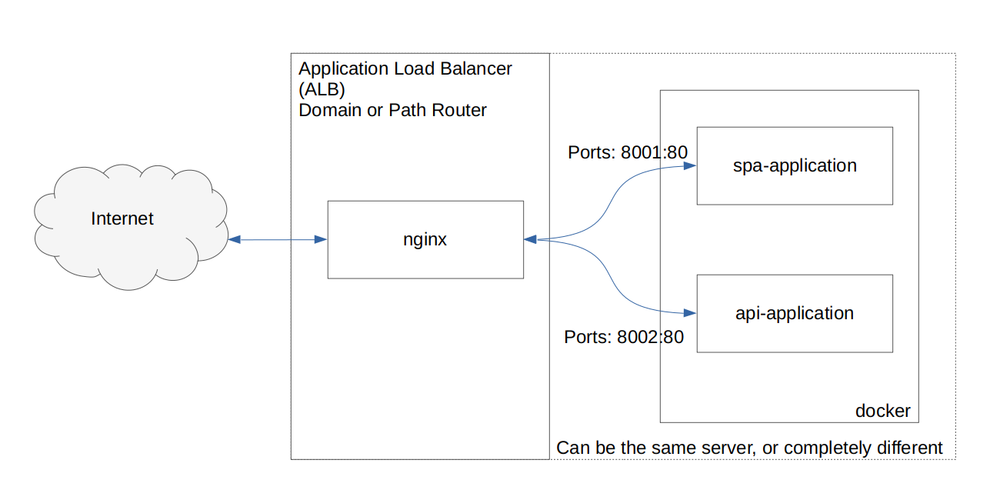

# nginx + letsencrypt + docker = multistack web app

**Difficulty Level**: entry



Imagine that we have a few different web services which work on different
languages, environment with its own configuration set.

What would be the approach of running applications on staging or live
environment easily without over-engineering and easy deployment process with CI
pipelines.

Obvious first response is to use **docker** for wrapping our applications into
different environments.

But how would we route traffic from incoming requests into various docker
containers?

The answer is to use **nginx** as a reverse proxy and route traffic based on domain
name or path name.

And for taste of being encrypted and have all those services and microservices
behind https we use free **Let's encrypt** certificates and their bot to keep
certificates and configuration up-to-date automatically.

Let's see how can we do this...

-more-

## Input data

We have:

- a FQDN: `example.com`
- a VPS or bare metal `server` (let's say Debian/Ubuntu)
- example.com domain has a `DNS record` pointing to our server interface
- an api backend web application wrapped into a container image (let's call it
`api-container`  and let's assume it needs to respond to `api.example.com`)
- a SPA web application wrapped into another container image (let's call it
`spa-container` and let's assume it needs to respond to `example.com` directly)

## Action

### Installation steps

1. **ssh** into our server
2. Install **nginx**:
```
$ apt-get install nginx
```
3. Install **docker**:  
*([https://docs.docker.com/engine/install/ubuntu/](https://docs.docker.com/engine/install/ubuntu/))*
4. Install **certbot**:
```
$ apt-get install certbot
```
5. Install certbot **plugin** for nginx (`python3-certbot-nginx`):
```
$ apt-get install python3-certbot-nginx
```

### Configuration steps
*(make sure to use `sudo` command as needed)*

1. Configure **nginx** to work as a reverse proxy for `spa-container` and
`api-container`, so open conf file (use editor of your choice nano/vi/vim/etc):
```
$ nano /etc/nginx/conf.d/default.conf
```
Add entries for two new server sections:
```
...
server {
    listen 80;
    server_name example.com;
    location / {
         proxy_pass  http://127.0.0.1:8001/;
         proxy_set_header Host $host;
         proxy_set_header X-Forwarded-Proto $scheme;
         proxy_pass_request_headers on;
    }
}

server {
    listen 80;
    server_name api.example.com;
    location / {
        proxy_pass  http://127.0.0.1:8002/;
        proxy_set_header Host $host;
        proxy_set_header X-Forwarded-Proto $scheme;
        proxy_pass_request_headers on;
    }
}
...
```
Then save the file, do syntax validation and apply it with `reload` command:
```
$ sudo nginx -t && sudo nginx -s reload
```

2. Now we're ready to run a new certificate retrieval.  

One cert for each domain:
```
$ certbot --nginx -d example.com
$ certbot --nginx -d api.example.com
```
Or a single certificate covering two domains:
```
$ certbot --nginx -d example.com -d api.example.com
```
Follow instructions from console and follow to the next step 3.

3. Verify certificates being added to nginx configuration (lines commented as
`# managed by Certbot`):
(note fancy thing - we can add `http2` keyword option next to the listening port
and nginx will be serving all connections with the new version of protocol)
```
...
server {
    listen 80;
    server_name example.com;
    location / {
        proxy_pass  http://127.0.0.1:8001/;
        proxy_set_header Host $host;
        proxy_set_header X-Forwarded-Proto $scheme;
        proxy_pass_request_headers on;
    }

    listen 443 ssl http2; # managed by Certbot
    ssl_certificate /etc/letsencrypt/live/example.com/fullchain.pem; # managed by Certbot
    ssl_certificate_key /etc/letsencrypt/live/example.com/privkey.pem; # managed by Certbot
    include /etc/letsencrypt/options-ssl-nginx.conf; # managed by Certbot
    ssl_dhparam /etc/letsencrypt/ssl-dhparams.pem; # managed by Certbot
}

server {
    listen 80;
    server_name api.example.com;
    location / {
        proxy_pass  http://127.0.0.1:8002/;
        proxy_set_header Host $host;
        proxy_set_header X-Forwarded-Proto $scheme;
        proxy_pass_request_headers on;
    }

    listen 443 ssl http2; # managed by Certbot
    ssl_certificate /etc/letsencrypt/live/api.example.com/fullchain.pem; # managed by Certbot
    ssl_certificate_key /etc/letsencrypt/live/api.example.com/privkey.pem; # managed by Certbot
    include /etc/letsencrypt/options-ssl-nginx.conf; # managed by Certbot
    ssl_dhparam /etc/letsencrypt/ssl-dhparams.pem; # managed by Certbot
}
...
```

4. Verify that both url can be opened in browser via http and https protocols by:

[http://example.com](http://example.com)  
[https://example.com](https://example.com)  
[http://api.example.com](http://api.example.com)  
[https://api.example.com](https://api.example.com)  

As of now nginx should respond with `502 Bad Gateway` error code, because we did
not start our docker application instances.

5. Start both applications containers with external port mapping as below:  
*(assuming application is listening port 80, change to your own, depending on
configuration inside of container)*
```
docker run --rm \
    -p 8001:80 \
    --name spa-container \
    -d spa-container:latest

docker run --rm \
    -p 8002:80 \
    --name api-container \
    -d api-container:latest
```

6. That's it, open urls from step 4 above and verify response from both
   applications through http and https protocols.

## Benefits
On the advanced level configuration may be more complicated. For example we can
put **nginx** as a hardware load balancer, docker instances can be set on a
separate cluster. And still quite easy to manage and setup.

In terms of services which have cloud providers that would be: Application Load
Balancer (ALB), Docker cluster (e.g. AWS ECR, ECS/EKS), Certificate Management
System (AWS ACM).


## Conclusion
In this simple exercise we did setup an Application Load Balancer based on
**nginx**, then setup **nginx** to serve connections through **https** protocol
with certificates retrieved from **let's encrypt** and ran our applications in
independent **docker** containers.

The key point is that the whole setup is very cheap if not free and can be done
quickly and easily with almost no deep knowledge. Benefit of using **certbot**
is automated updates when certificate renewal time comes (setup and forget).


If you have any notes, questions or errors correction, please point them in the
comments below.

 #linux #docker #nginx #https #letsencrypt #certbot